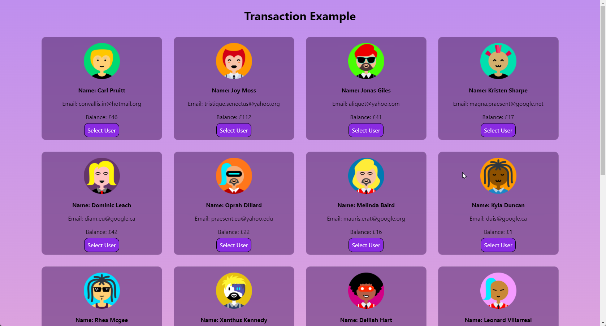
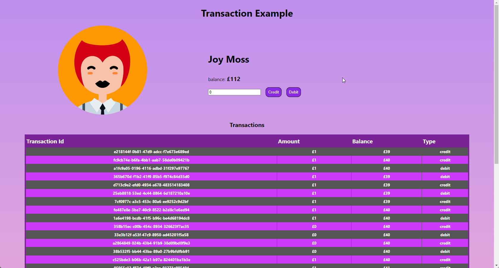

# LeoVegas tech test  Frontend

This is my tech test submition for the LeoVegas TechTest,
A frontend implementation to the backend API
The back end api can be found hosted on [Heroku](https://transactionsexample.herokuapp.com/) and the Github repo can be found [here](https://github.com/continuum-web/transactionExample-backend) 
and is to be used with the [frontend](https://github.com/continuum-web/transactionExample-frontend).

The Frontend uses the following technologies
+ reactJS
+ Axios
+ React Router DOM

The project is designed to display a list of users, where one can be selected, on the single user page you can see the details of the user, the transaction history and
the balance. On this page you can also use the form to add to or remove from the users balance, this will 
optimistically render the balance and update the transaction history, this way the user gets instant feedback.

The project uses React to create a single page application
to render the contents.

## Showcase

User List

 

Single user with transaction history

  

## Thoughts
Overall the project is designed to be scalable with the persistent data, using pouchDB fit in to the scope of the brief (being in memory) however for a production database I would choose something more along the lines of an SQL database for more structure and far more scalability.

I chose to use React because I wanted the front end to be able to rerender information without having to rerender the full page, For example after crediting and debiting an account.

## Testing
In the future and given more time I would implement testing on the front and back end of the project using jest for the backend and cypress for the front end.

## Final Thoughts
I really enjoyed the challenge presented by this tech test, the main challenge I had was adapting the project from the java based brief and finding an in memory database.